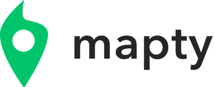
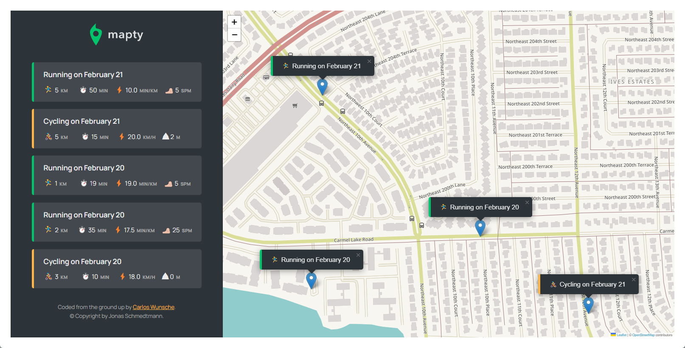

  

 

  
    
    

---

Omnifood is a front-end for a fictional food delivery company also named Omnifood.

## Features

- 100% HTML and CSS
- Responsive Design
- Checked for Accesibility

## Live preview

Access the live preview [following this link.](https://cw-mapty.netlify.app)

## Screenshot

## Credits

- Coded from the ground up by Carlos Wunsche.

- Copyright &copy; Jonas Schmedtmann.
